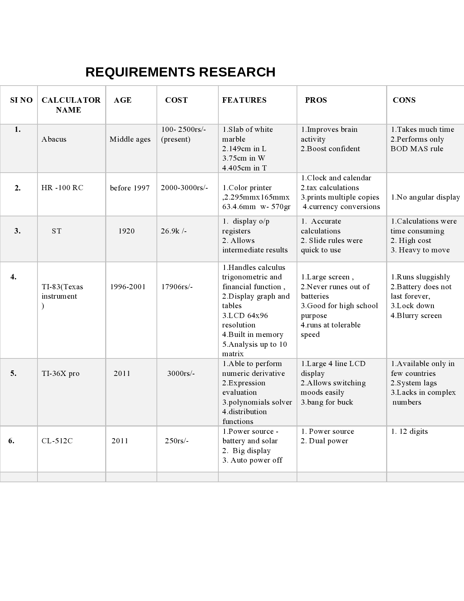
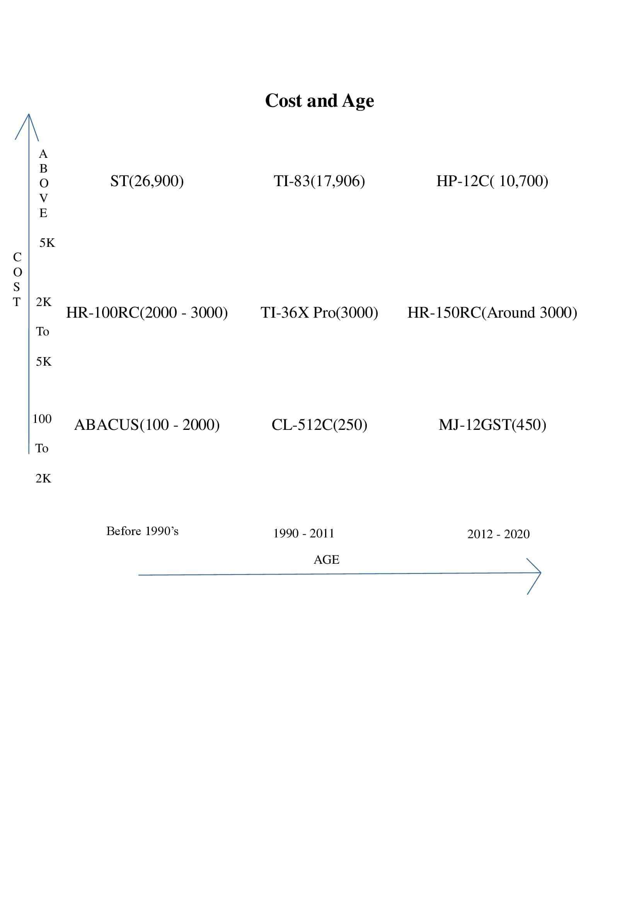

# Requirements
## Introduction
A device that performs logic and arithmetic digital operations based on numeric data which are entered by pressing numerical data which are entered by pressing numerical and control keys .

Also known as calculating machine.A calculator is a device that performs arithmetic operations on numbers. The simplest calculators can do only addition,subtraction,multiplication and division. More sophisicated calcultors can handle exponential operations,factorial,logarithms,trignometric functions and hyperbolic functions.

## Research

## cost and age

## Defining system
- Provide operations for the user to select one at a time.
- Can be used to perform any process that consists of a sequence of steps each of which applies one of the operations including addition,subtraction,multiplication,division,modulus.
- Can do some of the advanced calculations which normal calculators can&#39;t do like finding the percentage of the number, exponential, prime number and factorial of a number.
## SWOT ANALYSIS

# 4W&#39;s and 1&#39;H

## Who:

**First, used calculators where bones, pebbles used for arithmetic operations. Then the abacus was used by sumerians and egyptians before 2000BC. The first basic calculator was invented in 1642 by french inventor and mathematician Blaise pascal. World&#39;s first handheld electronic scientific calculator was invented by Whitney at hewlett packard in 1967.**

## What:

**Any calculator is used for making our arthimetic, financial, trignometric etc. calculations to made fast. These literally used to save our time in daily life.**

## When:

**When the calculations takes more time and they are complex to make we can use calculators.**

## Where:

**Calculators are used mostly in various fields like:**

- **architecture we use graphical calculators**
- **in finance we use financial calculators**
- **we use scientific calculators for engineering purpose.**

## How:

**When there is a need, there is a innovation. Likeways, for required calculator needed in the market simultaneously that calculator in demand will be made.**

# Detail requirements
## High Level Requirements:

- A mobile calculator app that should perform simple calculations,scientific calculations and conversions
- The calculator was developed using standard c language and should run on all machines supporting gcc compiler.
- Should display following menu bar to users like -

1. Addition
2. Subtraction
3. Multiplication
4. Division

- On encountering a division by 0 the display should read &quot;Cannot Divide by 0&quot; and typing the key &quot;C&quot; should reset the calculator.
- Includes buttons with number 0 to 9.
- calculator must provide with on,off and memory operations.
- On calculating the square root value of a negative operand the display should read &quot;Wrong Operand&quot;.

##  Low level Requirements:

The calculator has the following things like 0,9,8,7,6,5,4,3,2,1,.,+,-,%,^,\*,(),=.sqrt. In any situation the calculator has to produce a correct result defined by the well known arithmetic rules. If the calculations is impossible the calculator has to display information helping.The user to resolve the erroneous situation, like:

• On encountering a division by 0 the display should read &quot;Cannot divide by 0&quot; and typing the

key &quot;C&quot; should reset the calculator.

• On calculating the square root value of a negative operand the display should read &quot;Wrong

operand&quot;.

• On erroneous operand or operation keys the display should read &quot;Reset (C) to continue&quot; or

&quot;Clear (CE) to continue&quot; as appropriate.

Of course, any situation can be cleared using the main reset key &quot;C&quot;.

Functional requirements are all the arithmetic and scientific operations whose buttons you see, as well as memory store, recall and clear. Turn on and off would also classify as functional. Non functional requirements would be a split second to deliver the answer, any slower and you&#39;d reject the calculator. It should also be scalable I. E. Be able to work with large numbers. Another important non functional requirement is that the key layout should follow the standard layout of a calculator, and the keys should be the right size and shape for usability.

1.The user can perform operations beyond arithimetic.

2.The user can store a value in memory for later use.

3. The user can press the &quot;EQUALS&quot; button repeatedly to repeat the previous question .

4.When the user enters an expression with more than two operands,operator precedence is applied.

5.We can do alot of operations.

6.Using high level requirements like

- Addition

-Substraction

-Multiplication

-Division

7.It can perform all the difficult fuctions.

8.We can peform activites more than one at a time.

9.We can save previous values here and perform it in the next operatio

